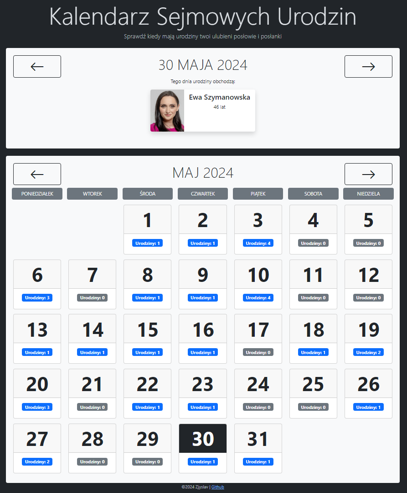

# Sejm Calendar App
Simple web app displaying birthdays of Polish MPs using [Sejm's API](https://api.sejm.gov.pl/sejm.html).

## Technologies used
* C#/.NET
* Blazor Server
* HttpClient
* Bootstrap

# Screenshots

## Disclaimer

Unfortunatelly, as of May 2024 Sejm's API responds to all request made from this site hosted on Azure with 403 Unauthorized (even though the API requires no authorization). It used to work fine and it still works when I run it locally. I've been unable to configure my hosting in a way that the API accepts my calls. It's possible that the site's IP has been blacklisted and there's nothing I can do.
